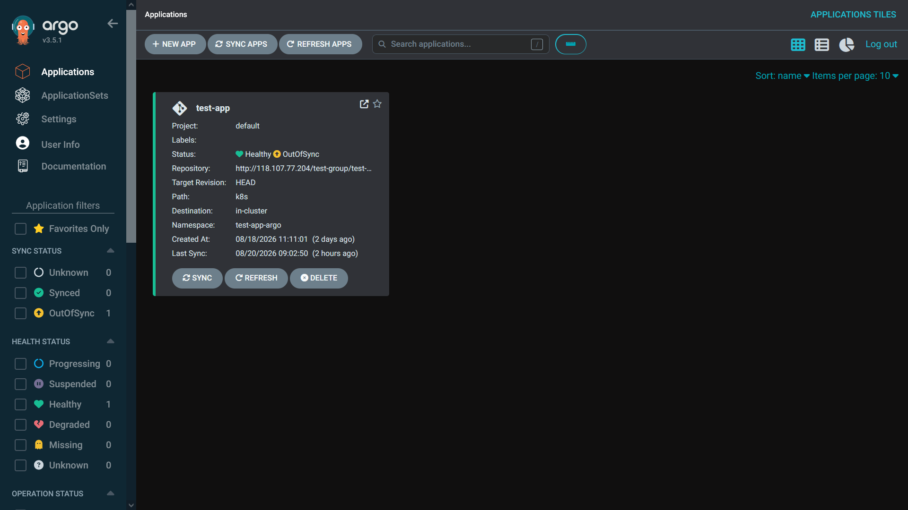
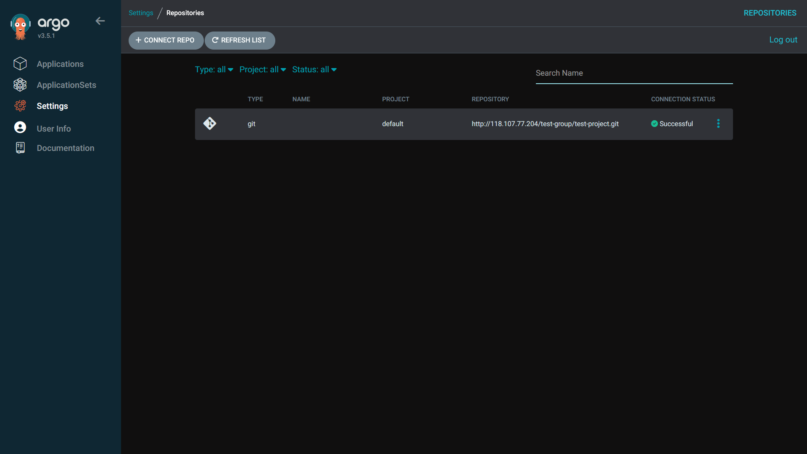
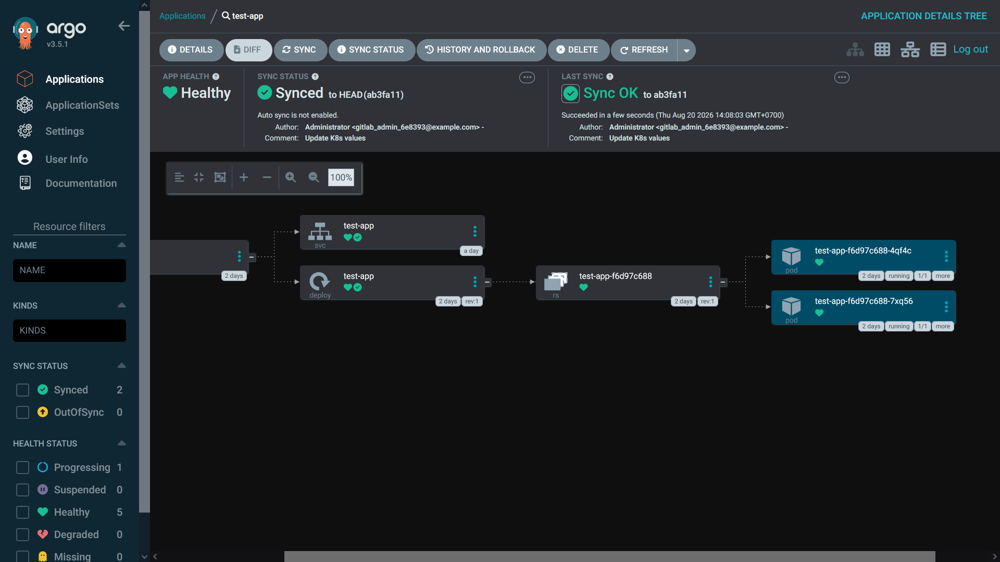

**Tìm hiểu về ArgoCD**

ArgoCD là công cụ CD theo mô hình GitOps dành riêng cho Kubernetes. ArgoCD tự động đồng bộ hóa trạng thái thực tế của các ứng dụng trong K8s với cấu hình được khai báo trong git repo, giúp đảm bảo tính nhất quán, tự động hóa quy trình vận hành và loại bỏ các thao tác triển khai thủ công rủi ro.

Thực hiện lấy các cấu hình K8s như các manifest deployment, service... từ repo git và áp dụng deploy trực tiếp vào cụm K8s. ArgoCD giúp dev tự động triển khai các thay đổi vào K8s chỉ bằng cách cập nhật repo git.

**GitOps**

GitOps là phương pháp quản lý hạ tầng và triển khai phần mềm dùng kho lưu trữ git làm nguồn chân lý duy nhất (single source of truth). Mọi thay đổi về cấu hình hay mã nguồn đều khai báo trên git và được tự động đồng bộ hóa vào hệ thống thực tế.

- Khai báo toàn bộ (Declarative): toàn bộ hạ tầng và ứng dụng được mô tả bằng file cấu hình.
- Lưu trữ phiên bản trên git: mọi trạng thái mong muốn đều nằm trong git history.
- Tự động đồng bộ (Automatic Sync): công cụ tự động kéo và áp dụng thay đổi từ git vào môi trường chạy thực.
- Liên tục kiểm tra (Continuous Reconciliation): hệ thống liên tục so sánh trạng thái thực tế với git để phát hiện lệch pha.

**Quy trình làm việc**

1. Định nghĩa cấu hình: Các file manifest (deployment, service...) Kubernetes được định nghĩa dưới dạng tệp yaml và đẩy lên repo git.

2. Giám sát thay đổi: ArgoCD liên tục theo dõi kho lưu trữ git để phát hiện bất kỳ sự thay đổi nào trong mã nguồn cấu hình.

3. Tự động đồng bộ: Khi phát hiện thay đổi, ArgoCD sẽ lấy cấu hình mới từ kho lưu trữ và tự động áp dụng chúng vào cụm Kubernetes.

**Triển khai ArgoCD**

Thực hiện cài đặt ArgoCD trong K8s hoặc K3s:

```
kubectl create namespace argocd
kubectl apply -n argocd --server-side --force-conflicts -f https://raw.githubusercontent.com/argoproj/argo-cd/stable/manifests/install.yaml
```

Kiểm tra xem các pod đã chạy chưa:

```
kubectl get pods -n argocd
```

Để tương tác với ArgoCD qua UI web, thực hiện expose Argo bằng NodePort:

```
kubectl patch svc argocd-server \
  -n argocd \
  -p '{"spec":{"type":"NodePort"}}'
kubectl get svc -n argocd
```

Khi truy cập UI web của Argo sẽ cần thực hiện đăng nhập. Username default sẽ là admin, còn password thì có thể lấy như sau:

```
kubectl -n argocd get secret argocd-initial-admin-secret \
  -o jsonpath="{.data.password}" | base64 -d
```

Giao diện chính của ArgoCD:



**Kết nối ArgoCD với repo git**

Có thể kết nối ArgoCD với repo git qua SSH hoặc HTTPS. Hướng dẫn setup bằng SSH:

1. Vào Settings -> Repositories -> Connect Repo. Chọn Via HTTP/HTTPs.

2. Chọn type là git, nhập url của repo (cần kết thúc bằng .git), nhập username và personal access token của tài khoản git của người dùng (Gitlab, Github...)

Nếu connect thành công, connection status sẽ là successful:



**Deploy application**

Để ArgoCD có thể thực hiện deploy ứng dụng trong K8s/K3s, cần có image của ứng dụng. Cách đơn giản nhất là thực hiện build docker image trong quá trình CI và upload lên Docker hub, và thực hiện lấy image đó trong manifest deployment. VD: một ứng dụng React đơn giản thì sẽ có file manifest CI gitlab như sau [.gitlab-ci.yml](test-app/.gitlab-ci.yml)

- Gitlab runner thực hiện login vào Docker hub sử dụng username và personal access token được cung cấp dưới dạng biến trong gitlab.

- Thực hiện build image và push lên docker hub.

Trong manifest deployment [deployment.yaml](test-app/k8s/deployment.yaml)

- Thực hiện pull image về.

- imagePullPolicy là một setting Kubernetes xác định khi nào node cần pull image mới về. Always là mỗi khi bắt đầu container, IfNotPresent yêu cầu node sử dụng image local trước nếu có rồi mới pull nếu cần, còn Never thì node sẽ ko thực hiện pull image mà chỉ sử dụng image local.

Có thể thực hiện deploy ứng dụng bằng 2 cách: sử dụng 1 file manifest yaml hoặc tạo trực tiếp trong UI.

Cách 1: file manifest:

Thực hiện edit as yaml:

```
apiVersion: argoproj.io/v1alpha1
kind: Application

metadata:
  name: test-app

  namespace: argocd

spec:

project: default
source:
  repoURL: http://118.107.77.204/test-group/test-project.git
  path: k8s
  targetRevision: HEAD
destination:
  server: https://kubernetes.default.svc
  namespace: test-app-argo
syncPolicy:
  syncOptions:
    - CreateNamespace=true
```

Cách 2: nhập trực tiếp trong UI:

- Nhập application name, project name có thể để default, sync policy có thể để manual hoặc automatic tùy ý muốn.

- Nhập url repo, chọn nhánh và path tới thư mục chứa các manifest k8s của repo

- Tại destination, nhập cluster url (nếu deploy argocd trực tiếp trong K8s hay K3s thì chọn url cluster default) và nhập namespace. Để Argo tự tạo namespace, chọn Auto-create namespace

Sau khi tạo application thành công, nếu để sync ở manual thì app sẽ ở trạng thái sync OutOfSync và Health là Missing, cần thực hiện nhấn sync manual.

Note: nếu có định nghĩa namespace trong file deployment thì namespace cần tạo phải cùng tên.

Deploy thành công:




