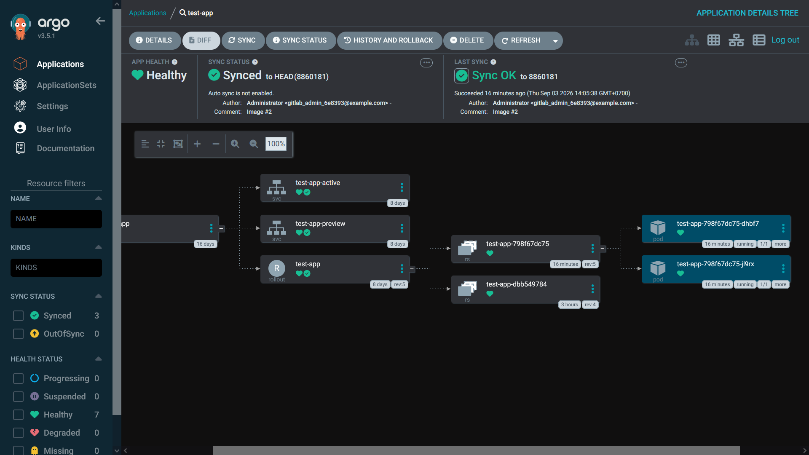

**Blue-green deployment**

Blue-green deployment là phương pháp deploy phần mềm sử dụng 2 setup production khác nhau cùng lúc, gọi là blue và green. User sẽ sử dụng service thông qua 1 trong hai môi trường, còn môi trường còn lại sẽ deploy các phiên bản mới và cập nhật của service. Sau khi quá trình deploy này hoàn tất, user request sẽ được route về môi trường này và môi trường đầu trở thành môi trường dự bị cho lần deploy tiếp theo.

Ưu điểm:

- Giảm thời gian downtime và maintenance, user vẫn có thể sử dụng service bình thường trong quá trình deploy và được redirect tới service mới khi hoàn thành.

- Testing an toàn, có thể test trong môi trường production thật trước khi public.

- Dễ dàng rollback nếu có vấn đề.

Nhược điểm:

- Sử dụng 2 môi trường production sẽ cần nhiều resource hơn, đắt đỏ hơn.

- Deploy khó khăn nếu có sự thay đổi lớn về DB.

**Sử dụng Argo Rollout để thực hiện blue-green deployment**

Argo Rollouts là một công cụ thuộc hệ sinh thái Argo, hoạt động như một Kubernetes controller. Trong manifest, thay vì để loại deployment:

```
apiVersion: apps/v1
kind: Deployment
```

thì ứng dụng có thể được triển khai bằng manifest kiểu rollout:

```
apiVersion: argoproj.io/v1alpha1
kind: Rollout
```

Khi có thay đổi trong phần template như cập nhật Docker image, Argo rollouts sẽ tạo một ReplicaSet mới và áp dụng các setting cấu hình trong phần strategy. Tổng thể thì argo rollout quản lý tạo và scale replicaset, chuyển traffic giữa các phiên bản, tạm dừng rollout, promote phiên bản mới, rollback... Argo CD chịu trách nhiệm GitOps và đồng bộ manifest, trong khi Argo Rollouts chịu trách nhiệm kiểm soát quá trình chuyển đổi giữa các phiên bản ứng dụng.

Trong argo rollouts, để thực hiện blue-green deployment, thay vì tạo 2 file deployment khác nhau (ví dụ như test-app-blue và test-app-green trỏ tới 2 image khác nhau) thì sẽ chỉ cần một resource là file manifest rollout. Trong file rollout sẽ chỉ định stable ReplicatSet (version cũ, service active, dùng cho production) và preview replicaset (version mới, preview service, testing).

Setup Argo rollout: cách cài đặt đơn giản nhất là sử dụng script install chính thức:

```
kubectl create namespace argo-rollouts
kubectl apply -n argo-rollouts -f https://github.com/argoproj/argo-rollouts/releases/latest/download/install.yaml
```

Thực hiện kiểm tra sau khi cài đặt:

```
kubectl get pods -n argo-rollouts
kubectl get crd rollouts.argoproj.io
```

Nên cài đặt thêm plugin kubectl của Argo rollout:

```
curl -LO https://github.com/argoproj/argo-rollouts/releases/latest/download/kubectl-argo-rollouts-linux-amd64
chmod +x ./kubectl-argo-rollouts-linux-amd64
sudo mv ./kubectl-argo-rollouts-linux-amd64 /usr/local/bin/kubectl-argo-rollouts
```

Tiếp đến là setup các file manifest cho ứng dụng. Sử dụng lại ứng dụng React test-app, sẽ có 2 file service riêng biệt cho active và preview: [service-active.yaml](rollout/service-active.yaml) và [service-preview.yaml](rollout/service-preview.yaml). Hiện tại, 2 service sẽ trỏ tới 2 port khác nhau, mục tiêu là khi thực hiện rollout thì các thay đổi sẽ diễn ra ở preview trước rồi mới tới active.

Để triển khai rollout, cần một file manifest có type là rollout: [rollout.yaml](rollout/rollout.yaml)

- apiVersion phải là argoproj.io/v1alpha1 để có thể sử dụng Argo rollout.

- strategy: blueGreen: xác định chiến lược blue-green

- set activeService và previewService.

- autoPromotionEnabled: false: rollout sẽ không tự động chuyển phiên bản mới sang production mà hệ thống sẽ tạm dừng và chờ người quản trị thực hiện promotion. Nếu autoPromotionEnabled: false thì trong quá trình triển khai, Argo CD sẽ hiển thị app health là suspended. 

Quá trình triển khai phiên bản mới:

- Giả sử đang chạy image version 1. Người dùng truy cập version 1 ở active service.

- Cập nhật sang image version 2. ArgoCD đồng bộ thay đổi xuống K8s, Argo rollouts phát hiện spec.template đã thay đổi và tạo replicaset mới.

- Version 2 được triển khai ở preview.

Kiểm tra trạng thái rollout:

```
kubectl get rollout
kubectl argo rollouts get rollout test-app
```

Thực hiện promote:

```
kubectl argo rollouts promote test-app -n <namespace>
```

Sau khi promote, nếu ko có lỗi khác xảy ra thì app health sẽ chuyển về healthy, các pod cũ sẽ bị thu hồi, service active sẽ dần chuyển sang sử dụng image version mới.



