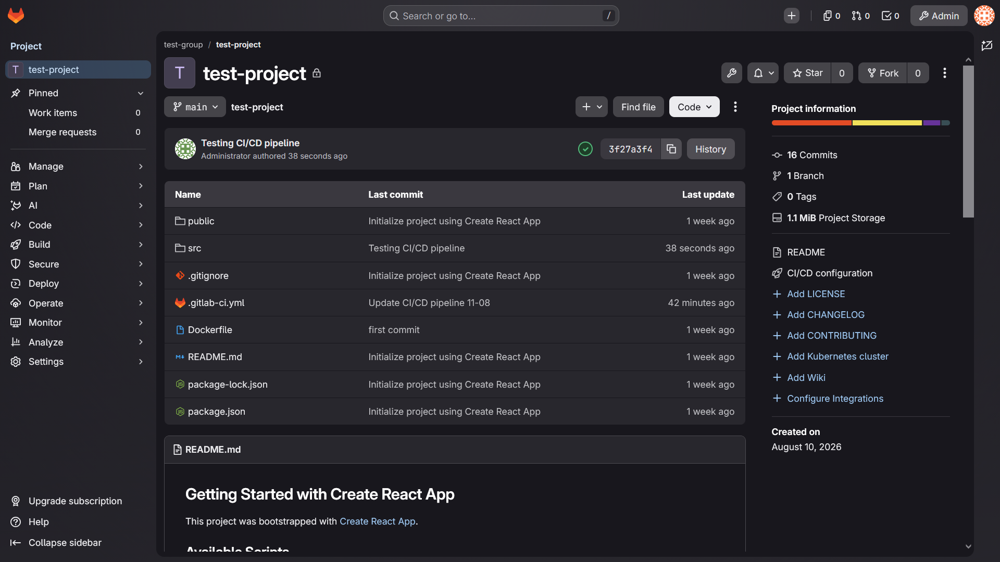
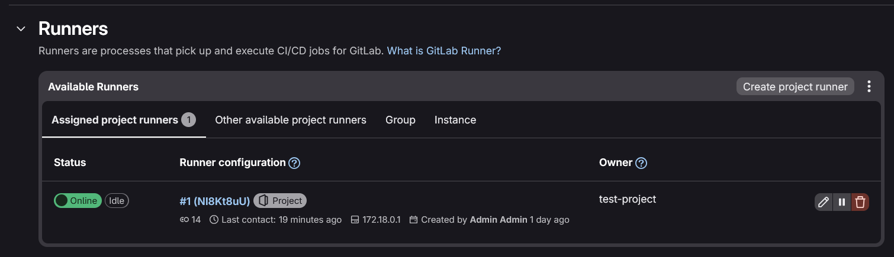
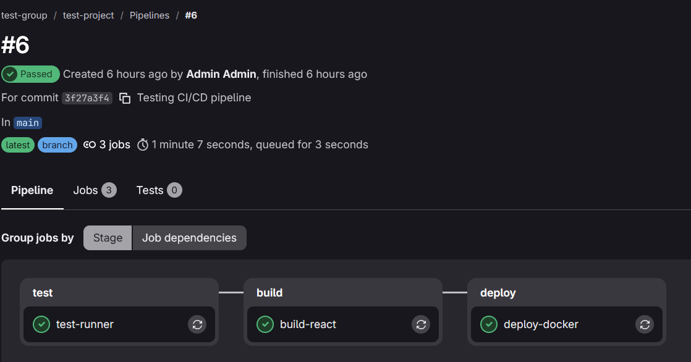
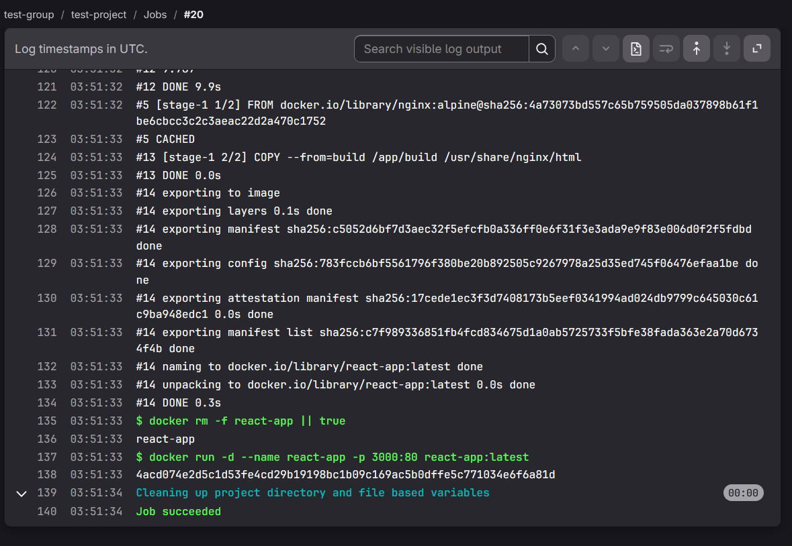

<h1 align="center">Triển khai CI/CD pipeline bằng Gitlab</h1>

Phương pháp đơn giản nhất để triển khai CI/CD pipeline thuần self-host, ko dựa vào các service cloud hay bên thứ 3 là triển khai self-host Gitlab và Gitlab runner. Mục tiêu của phần triển khai này là xây dựng một hệ thống Gitlab self-host trên server riêng, kết hợp với Gitlab runner để tự động hóa quá trình triển khai CI/CD. Hệ thống được triển khai theo hướng:

```
Developer
    │
    │ git push
    ▼
GitLab Self-Hosted
    │
    │ Trigger pipeline
    ▼
GitLab Runner
    │
    ├── Build React
    ├── Tạo Artifact
    ├── Build Docker Image
    └── Deploy Docker Container
             │
             ▼
       React Application
```

**Gitlab self-host**

Gitlab là một nền tảng DevOps cung cấp nhiều chức năng trong một hệ thống như Git repository, quản lý source code, branch và merge request, CI/CD... Có thể sử dụng Gitlab tại gitlab.com online do chính Gitlab quản lý, hoặc thực hiện triển khai self-host trên server của tổ chức. Lý do sử dụng Gitlab self-host:

- Toàn bộ Gitlab instance được triển khai và quản lý trên server riêng.
- Kiểm soát dữ liệu: source code, repository và các dữ liệu liên quan được lưu trữ trên hệ thống.
- Gitlab cung cấp sẵn CI/CD thông qua .gitlab-ci.yml và Gitlab Runner.

Có nhiều cách để thực hiện self-host Gitlab:

- Cài đặt trực tiếp bằng Linux packaged dạng deb hoặc rpm. Dễ cài đặt, Gitlab tự quản lý các dependency của nó, có sẵn gitlab-ctl nhưng khó quản lý hơn một số phương pháp khác và khó migrate.

- Chạy trong container thông qua Docker/Docker compose. Dễ triển khai, backup, migrate sang môi trường khác, self-contained trong một folder nhưng container sẽ khá nặng, ko tối ưu cho HA.

- Triển khai trong K8s/K3s qua Helm. Có thể scale các component, tận dụng Kubernetes, sử dụng ingress...phù hợp với production lớn nhưng cấu hình phức tạp hơn, yêu cầu tài nguyên cao.

Với mục đích tìm hiểu, sẽ thực hiện deploy Gitlab trong Docker container. Trước tiên cần setup directory cho gitlab:

```
mkdir gitlab
cd gitlab
mkdir config
mkdir logs
mkdir data
```

Sau đó trong thư mục gitlab, tạo file docker-compose.yml

```
services:
  gitlab:
    image: gitlab/gitlab-ee:latest
    container_name: gitlab

    restart: always

    hostname: gitlab.local

    environment:
      GITLAB_OMNIBUS_CONFIG: |
        external_url '<url>'

    ports:
      - "80:80"
      - "8443:443"
      - "2222:22"

    volumes:
      - ./config:/etc/gitlab
      - ./logs:/var/log/gitlab
      - ./data:/var/opt/gitlab

    shm_size: "256m"
```

- Compose sẽ thực hiện pull image gitlab mới nhất về. Có 2 loại image có thể sử dụng: enterprise edition (gitlab-ee) hoặc community edition (gitlab-ce). gitlab-ee sẽ đầy đủ tính năng hơn như nặng nề hơn.

- GITLAB_OMNIBUS_CONFIG là nơi định nghĩa một số setting cho gitlab. Config của gitlab sẽ nằm trong file gitlab/config/gitlab.rb, có thể modify trực tiếp file config này nhưng thường thì nên inject setting qua file docker compose.

- Thực hiện map các port của gitlab với port của server. Map port 80 có nghĩa là sẽ access gitlab trực tiếp qua địa chỉ IP mà ko cần thêm port.

- Map các thư mục config, log, data.

Sau khi chạy dockerc compose, truy cập vào URL của Gitlab để thực hiện đăng nhập. User default sẽ là root, password ban đầu sẽ được lưu trong container:

```
docker exec -it gitlab grep 'Password:' /etc/gitlab/initial_root_password
```

Có thể thực hiện đổi password sau khi đăng nhập. Thực hiện setup profile admin và project đầu, sau đó thực hiện đẩy repo đầu lên để test hoạt động của Gitlab. 



Sau khi setup Gitlab thành công, thực hiện setup Gitlab runner.

**Gitlab runner**

Gitlab runner là runner riêng cho gitlab, có nhiệm vụ nhận job từ CI/CD pipeline, thực thi script và trả kết quả về cho Gitlab. Có 2 cách để chạy runner:

- Chạy trong Docker container.
- Chạy trực tiếp.

Chạy trong container đơn giản hơn, dễ kiêm soát hơn nên sẽ theo cách này. Để dễ dàng kiểm soát, nên sử dụng compose để chạy runner. Thực hiện tạo thư mục:

```
mkdir -p /gitlab-runner/config
cd /gitlab-runner
```

Tạo docker-compose.yml:

```
services:
  gitlab-runner:
    image: gitlab/gitlab-runner:alpine
    container_name: gitlab-runner
    restart: always
    volumes:
      - ./config:/etc/gitlab-runner
      - /var/run/docker.sock:/var/run/docker.sock
```

- Thực hiện pull image gitlab-runner về.
- Map volume thư mục config và bind mount Docker socket, cho phép Gitlab runner container sử dụng Docker daemon của server host để thực hiện các tác vụ docker như chạy lệnh và chạy container. Quan trọng để CI/CD pipeline có thể deploy image ứng dụng.

Thực hiện chạy compose của runner. Trong giao diện của Gitlab, vào Project -> Settings -> CI/CD -> Runners, tạo một Project Runner. Gitlab sẽ cung cấp thông tin để register runner, trong đó có authentication token. Trên server, thực hiện register runner:

```
docker exec -it gitlab-runner gitlab-runner register
```

Runner sẽ hỏi lần lượt về gitlab url, token, mô tả runner, executor (chọn docker và image mặc định là alpine:latest). Sau khi đăng ký thành công, runner sẽ hiện lên trong giao diện của Gitlab.



Sau khi setup runner thành công, có thể setup một CI/CD pipeline đơn giản để test hoạt động.

**Setup CI/CD pipeline**

Tương tự như với github actions, pipeline của Gitlab cx được định nghĩa trong một file yml là .gitlab-ci.yml. Source code sử dụng lần này là một ứng dụng React đơn giản, sử dụng Dockerfile:

```
FROM node:20 AS build
WORKDIR /app
COPY package*.json ./
RUN npm install
COPY . .
RUN npm run build
FROM nginx:alpine
COPY --from=build /app/build /usr/share/nginx/html
EXPOSE 80
```

File pipeline được sử dụng:

```
stages:
  - test
  - build
  - deploy

test-runner:
  stage: test
  script:
    - echo "Hello from GitLab Runner"
    - echo "Runner is working"

build-react:
  stage: build
  image: node:22
  script:
    - npm ci
    - npm run build
  artifacts:
    paths:
      - build/
    expire_in: 1 week

deploy-docker:
  stage: deploy
  image: docker:cli

  needs:
    - job: build-react
      artifacts: true

  script:
    - echo "DOCKER_HOST=$DOCKER_HOST"
    - env | grep -E '^DOCKER'
    - ls -l /var/run/docker.sock
    - docker version
    - docker build -t react-app:latest .
    - docker rm -f react-app || true
    - docker run -d --name react-app -p 3000:80 react-app:latest
```

- Định nghĩa 3 stage của pipeline là test, build và deploy. Test sẽ kiểm tra ban đầu xem runner có hoạt động bình thường hay ko, build để kiểm tra có lỗi trong source code và deploy sẽ thực hiện kiểm tra xem runner có access tới Docker socket hay ko, thực hiện build Docker image và deploy ứng dụng trong container.

- Mỗi stage sẽ gồm các step cần thực hiện tuần tự, các dòng script để runner chạy và các dependency là needs.

Thực hiện commit và push, pipeline sẽ được chạy. Có thể theo dõi hoạt động của pipeline trong UI:



Có thể nhấn vào từng stage để xem các log của stage đó:



Nếu pipeline đã chạy thành công, kiểm tra danh sách container đang chạy xem đã có container mới do ứng dụng react được tạo chưa.

