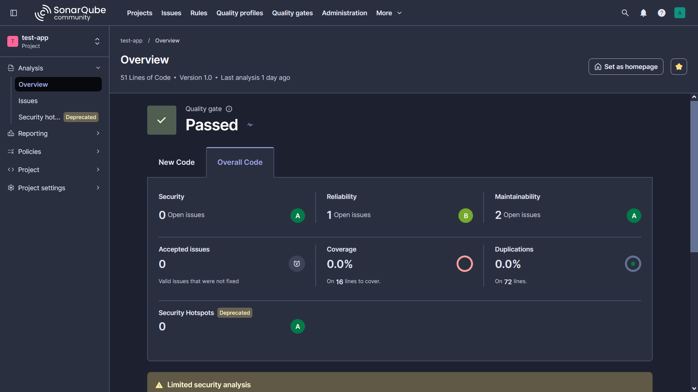

**Tìm hiểu về Sonarqube**

Sonarqube là nền tảng phân tích source code, giúp phát hiện các vấn đề về chất lượng code, bug, lỗ hổng bảo mật, lặp lại code... Sonarqube phân tích code mà ko cần chạy ứng dụng như một người dùng thực tế mà kiểm tra dựa vào bộ quy tắc đã được định sẵn. Mục tiêu là để phát hiện các vấn đề trước khi code được đưa vào production.

**Một số khái niệm quan trọng trong Sonarqube**

Project: mỗi ứng dụng hoặc repo sẽ ứng với 1 project trong Sonarqube. Mỗi project sẽ có phân tích source code, issue, metrics, quality gate, quality profile và history.

Issue: vấn đề mà Sonarqube phát hiện ra trong code. Một issue sẽ có type, mô tả, severity...

Quality profile: là bộ luật mà Sonarqube sử dụng để đánh giá và phân tích code, hỗ trợ nhiều ngôn ngữ lập trình khác nhau. Có thể sử dụng profile mặc định, copy profile, bật tắt các rule cụ thể và tạo profile riêng cho project.

Quality gate: điều kiện quyết định code có đạt chuẩn để tiếp tục pipeline hay ko (VD như số bug tối thiểu, số lỗ hổng tối thiểu, số dòng lặp,,,)

**Các thành phần chính**

Sonarqube server: chịu trách nhiệm host UI web và dashboard, quản lý các project, rule, quality profile và quality gate. Lưu kết quả phân tích.

Sonar scanner: công cụ thực hiện phân tích code, có nhiều loại cho nhiều ngôn ngữ và framework, package manager khác nhau (for Maven, Gradle, .NET, NPM...)

Sonarqube database: thực hiện lưu trữ.

**Setup Sonarqube**

Cách đơn giản nhất để chạy Sonarqube server là chạy trong docker sử dụng compose. File compose sử dụng:

```
services:
  sonarqube:
    image: sonarqube:community
    container_name: sonarqube
    depends_on:
      - db
    ports:
      - "9000:9000"
    environment:
      SONAR_JDBC_URL: jdbc:postgresql://db:5432/sonarqube
      SONAR_JDBC_USERNAME: sonar
      SONAR_JDBC_PASSWORD: sonar_password
    volumes:
      - sonarqube_data:/opt/sonarqube/data
      - sonarqube_extensions:/opt/sonarqube/extensions
      - sonarqube_logs:/opt/sonarqube/logs
    restart: unless-stopped

  db:
    image: postgres:16
    container_name: sonarqube-db
    environment:
      POSTGRES_USER: sonar
      POSTGRES_PASSWORD: sonar_password
      POSTGRES_DB: sonarqube
    volumes:
      - postgresql_data:/var/lib/postgresql/data
    restart: unless-stopped

volumes:
  sonarqube_data:
  sonarqube_extensions:
  sonarqube_logs:
  postgresql_data:
```

- Thực hiện download image sonarqube server và chạy ở port 9000

- Sonarqube sử dụng postgresql làm DB.

Thực hiện docker compose up -d và truy cập web UI và thực hiện đăng nhập. Username và password default là admin.

**Thực hiện scan source code local**

Thực hiện tạo project (Projects -> Create Project -> Manually). Đặt display name và chọn set up manually -> locally. Sau đó tạo token và lưu lại token này (bắt đầu bằng sqp_).

Tùy vào loại source code khác nhau thì sẽ có loại SonarScanner khác nhau. Ví dụ trong trường hợp này là một ứng dụng web FE sử dụng JS/npm, có 2 cách để chạy scanner:

- Thực hiện cài đặt scanner qua npm rồi chạy:

```
npm install -g @sonar/scan
sonar \
  -Dsonar.host.url=http://<SERVER_IP>:9000 \
  -Dsonar.token=squ_xxxxxxxxx \
  -Dsonar.projectKey=test-app
```

- Chạy sonar scanner cli trong docker:

```
docker run --rm \
  -e SONAR_HOST_URL="http://<SERVER_IP>:9000" \
  -e SONAR_TOKEN="squ_xxxxxxxxx" \
  -v "$(pwd):/usr/src" \
  sonarsource/sonar-scanner-cli
```

Để sử dụng cách này, cần có một file properties để scanner biết project key và source directory. Tạo file sonar-project.properties trong root của thư mục project:

```
sonar.projectKey=test-app
sonar.projectName=test-app
sonar.projectVersion=1.0

sonar.sources=src

sonar.sourceEncoding=UTF-8

sonar.exclusions=\
node_modules/**,\
build/**,\
dist/**,\
coverage/**,\
public/**

sonar.javascript.lcov.reportPaths=coverage/lcov.info
```

Khi chạy thành công, kết quả scan sẽ được cập nhật trong giao diện của Sonarqube:



**Tích hợp Sonarqube vào pipeline CI**

Để tích hợp Sonarqube vào trong pipeline CI, cụ thể là Gitlab CI thì chọn With Gitlab CI trong analysis method. Cần định nghĩa 2 biến môi trường trong project là SONAR_TOKEN và SONAR_HOST_URL. SONAR_TOKEN là đoạn token cần tạo giống với lúc trước còn SONAR_HOST_URL là url trỏ tới web UI của Sonarqube. Sau đó, trong repo tạo một file properties mới có nội dung như sau:

```
sonar.projectKey=test-app
sonar.qualitygate.wait=true
```

và cập nhật file ci:

```
image: 
  name: sonarsource/sonar-scanner-cli:11
  entrypoint: [""]

variables:
  SONAR_USER_HOME: "${CI_PROJECT_DIR}/.sonar"  # Defines the location of the analysis task cache
  GIT_DEPTH: "0"  # Tells git to fetch all the branches of the project, required by the analysis task

stages:
  - build-sonar


build-sonar:
  stage: build-sonar
  
  
  cache:
    policy: pull-push
    key: "sonar-cache-$CI_COMMIT_REF_SLUG"
    paths:
      - "${SONAR_USER_HOME}/cache"
      - sonar-scanner/
      
  script: 
  - sonar-scanner -Dsonar.host.url="${SONAR_HOST_URL}"
  allow_failure: true
  rules:
    - if: $CI_PIPELINE_SOURCE == 'merge_request_event'
    - if: $CI_COMMIT_BRANCH == 'master'
    - if: $CI_COMMIT_BRANCH == 'main'
    - if: $CI_COMMIT_BRANCH == 'develop'
```

Sau khi setup thành công, thực hiện push commit mới và kết quả scan sẽ được cập nhật trong giao diện.

