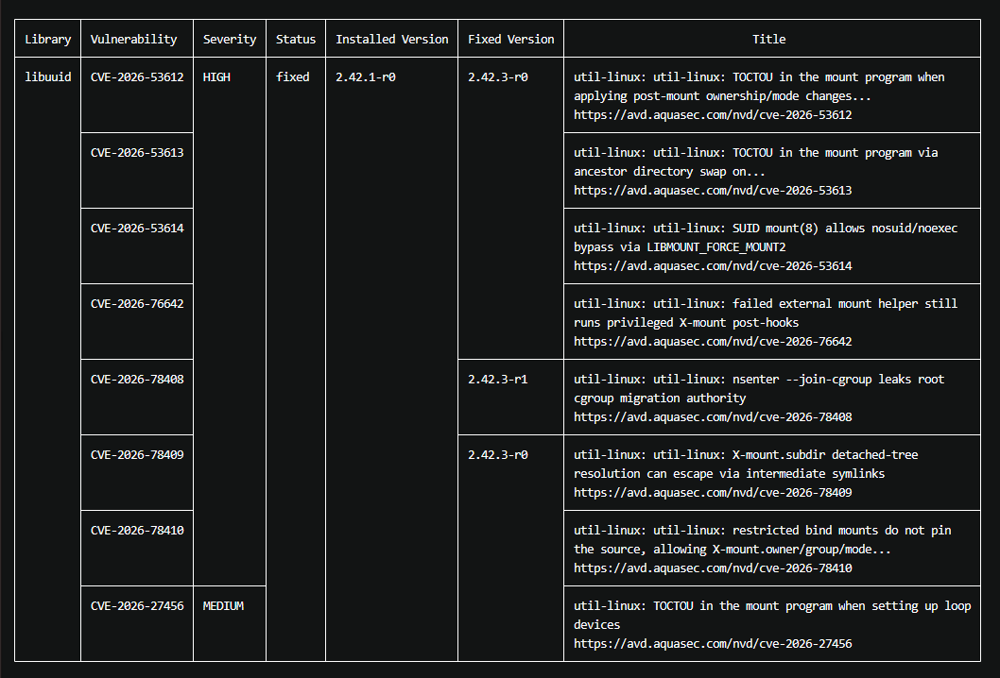

**Pentest trong CI/CD pipeline**

Pentest (Penetration testing) hay kiểm thử xâm nhập là quá trình đánh giá mức độ an toàn của một hệ thống bằng cách mô phỏng các kỹ thuật và hành vi mà một kẻ tấn công thực tế có thể sử dụng. Mục tiêu của Pentest ngoài tìm lỗi là xác định hệ thống có tồn tại lỗ hổng hay ko, lỗ hổng bị lợi dụng ntn, mức độ nghiêm trọng, hacker có thể truy cập sâu tới đâu và đưa ra phương án khắc phục.

Các loại pentest:

- Black-box testing: pentest ko biết thông tin nội bộ của hệ thống, mô phỏng attacker bên ngoài.
- White-box testing: pentest được cung cấp thông tin nội bộ, có thể kiểm tra sâu hơn.
- Gray-box testing: kết hợp giữa 2 phương pháp. Có 1 phần thông tin như application, API doc, tài khoản test... nhưng ko có access toàn bộ source code hay hệ thống.

Quy trình pentest gồm 4 bước cơ bản:
- Reconnaissance: thu thập thông tin như địa chỉ website, loại máy chủ, link...
- Enumerate: xác định các cổng truy cập.
- Exploit: khai thác lỗ hổng và xâm nhập.
- Documentation: gửi báo cáo lỗ hổng và bản mô phỏng cuộc tấn công lỗ hổng.

Trong ví dụ đang tìm hiểu lần này là một web app chạy trong K8s, các nhóm security testing quan trọng:

- SAST (Source code security): tìm vấn đề trực tiếp trong source code.
- Dependency Security: kiểm tra thư viện.
- Container security: kiểm tra Docker image.
- DAST (Dynamic Application Security Testing): kiểm tra ứng dụng khi nó đang chạy.
- Kubernetes Security

**Pentest trong DevOps**

Thông thường: Development -> Testing -> Deployment -> Production -> Pentest thì kiểm tra security khá muộn. DevOps cố gắng đưa security vào ngay trong quá trình phát triển và CI/CD với mục tiêu là tìm vấn đề an ninh càng sớm càng tốt.

**Sử dụng Trivy để thực hiện scan docker image**

Trivy là một công cụ security scanner mã nguồn mở dùng để phát hiện các lỗ hổng bảo mật và vấn đề cấu hình trong hệ thống phần mềm. Được thiết kế gọn nhẹ, dễ sử dụng và đặc biệt phù hợp với DevOps vì có thể chạy trực tiếp từ command line hoặc tích hợp vào CI/CD.

Trong ví dụ này, sẽ sử dụng Trivy để quét docker hay container image để tìm các package có lỗ hổng bảo mật. Trivy thường sẽ là một thành phần trong quá trình pentest tổng thể.

Để sử dụng Trivy trong terminal, thực hiện cài đặt qua package manager:

```
sudo apt-get install wget gnupg
wget -qO - https://aquasecurity.github.io/trivy-repo/deb/public.key | gpg --dearmor | sudo tee /usr/share/keyrings/trivy.gpg > /dev/null
echo "deb [signed-by=/usr/share/keyrings/trivy.gpg] https://aquasecurity.github.io/trivy-repo/deb generic main" | sudo tee -a /etc/apt/sources.list.d/trivy.list
sudo apt-get update
sudo apt-get install trivy
```

hoặc sử dụng install script:

```
curl -sfL https://raw.githubusercontent.com/aquasecurity/trivy/main/contrib/install.sh | sudo sh -s -- -b /usr/local/bin v0.74.0
```

hoặc cách đơn giản và contained nhất là thực hiện scan image qua docker:

```
docker run --rm \
  -v /var/run/docker.sock:/var/run/docker.sock \
  aquasec/trivy:0.73.0 \
  image duytranlinh0/test-app:1
```

Output của Trivy sẽ có dạng như sau:

- Số lượng vulnerability (VD: Total: 10 (UNKNOWN: 0, LOW: 4, MEDIUM: 4, HIGH: 2, CRITICAL: 0))
- Liệt kê các library gặp vấn đề.
- Cụ thể tên vulnerability.
- Mức độ nghiêm trọng: có 5 mức độ: Critical, High, Medium, Low và Unknown.

Do đây là một command docker, có thể tích hợp nó vào trong pipeline CI/CD để Gitlab runner có thể thực hiện như sau:

```
docker:
  stage: docker

  image: docker:27

  script:
    - echo "$DOCKERHUB_TOKEN" | docker login -u "$DOCKERHUB_USERNAME" --password-stdin
    - docker build -t "$IMAGE_NAME:latest" .

    - docker run --rm
        -v /var/run/docker.sock:/var/run/docker.sock
        -v "$CI_PROJECT_DIR:/workdir"
        aquasec/trivy:0.73.0
        image
        --severity HIGH,CRITICAL
        --exit-code 1
        "$IMAGE_NAME:latest"

    - docker push "$IMAGE_NAME:latest"
```

- Sau khi thực hiện build xong image, runner sẽ chạy trivy để scan image. Nếu phát hiện vấn đề có mức độ severity high hay critical thì sẽ tự động cancel pipeline, ko push image lên docker hub.

Ví dụ các lỗi gặp phải trong image, cùng với ghi rõ update mới có fix cho vấn đề đó.



**Những chức năng khác của Trivy**

1. Scan trực tiếp source code, file system:

Trivy có thể scan trực tiếp thư mục bằng cách chạy:

```
trivy fs .
```

hoặc chỉ định tên thư mục cụ thể. Trivy sẽ thực hiện kiểm tra các lỗ hổng trong dependency, secret, config sai/lỗi...

2. Scan repo Git:

Tương tự như với scan file system, Trivy cũng có thể thực hiện scan Git repo:

```
trivy repo .
```

Có thể scan các repo local hoặc repo remote.

3. Scan Kubernetes:

Trivy có thể scan config K8s:

```
trivy config deployment.yaml
```

- Kiểm tra các file manifest về các misconfig như securityContext: privileged: true hay các cấu hình quyền hạn ko an toàn... Có thể scan file yaml và Helm/Kustomize.

Trivy cx có thể scan cả cluster Kubernetes:

```
trivy k8s ...
```

